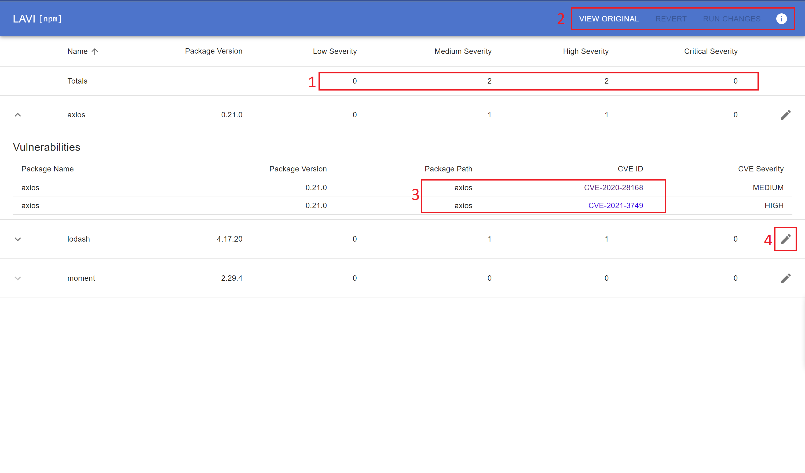
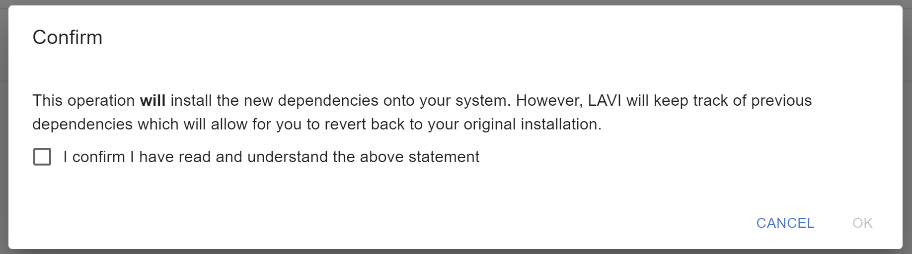
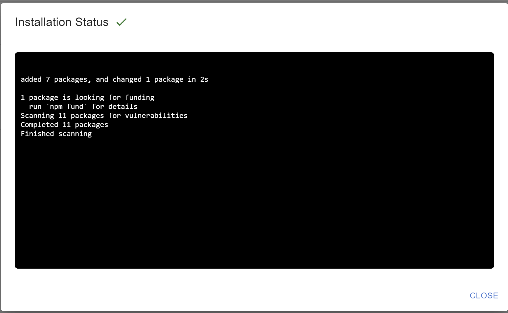

The LAVI ui is a critical component to the aided remediation feature of LAVI

## Base UI Components

When the UI is started via 
```bash
lavi [repo] -s
```
A browswer window will open with the UI. Below are some highlighted components that are important to understand.


1. Displays aggregated vulnerability counts for each level of vulnerability. Gives a good high level view of all vulnerabilities.
2. Toolbar that gives a few controls depending on the state of the application
    "View Original" gives the user the options to compare an edited state to the original state, so they can see if their changes are making a difference
    "Revert" allows users to revert the state of any changes back to the original state. LAVI will automatically backup any dependency files (package-lock.json, requirements.txt, etc) so the user can restore back to any state.
    "Run Changes" is what allows users to actually see the results of any modifications they make using the button at #4. This will also show a confirmation message so users know that when they run changes, the state of their dependencies will change, but there is always an option to revert back.
    The information icon provides a popup that gives complete information about the UI and how to use it.
3. Shows the path to a top level dependency so users know which top level dependency brought this vulnerability into their project. Also provides a link to read the CVE.
4. This button is what allows users to change versions of specific packages to hopefully remove the vulnerabilities. This is a centerpiece to the aided remediation.

## Running Aided Remediation
The flow for a user actually running aided remediation is quite simple. Find the package they wish to remediate, and use the edit button to select a new version. Once they have selected the new versions, the Run Changes button will be enabled (it is disabled if there are no changes), and they can run the changes. To the aim of protecting users and making sure they know what they are doing, the LAVI CLI show this popup when attempting to run any changes to ensure they know exactly what they are doing:

Once a user confirms they have read and understand what is going to happen, they are able to hit Ok and begin the installation of new dependencies. The following window then appears, giving them exactly what the console output would be if they ran the command themselves, along with status updates telling the user what phase the system is in. In order to prevent duplicate installs, the UI locks down during this process, so the user cannot run any other operations that could impact their system/project.


## After Running Aided Remediation
At the end of this process, if they are happy with the changes after comparing with the original using the View Original button at the top, they are free to kill the cli and continue on with their development. Again, with the idea of user protection in mind, the cli will always show a warning if the end state of dependencies differs from the original state.
```bash
You are exiting with a modified dependnecy tree. Would you like to revert back to the original tree? [Y/n]:
```